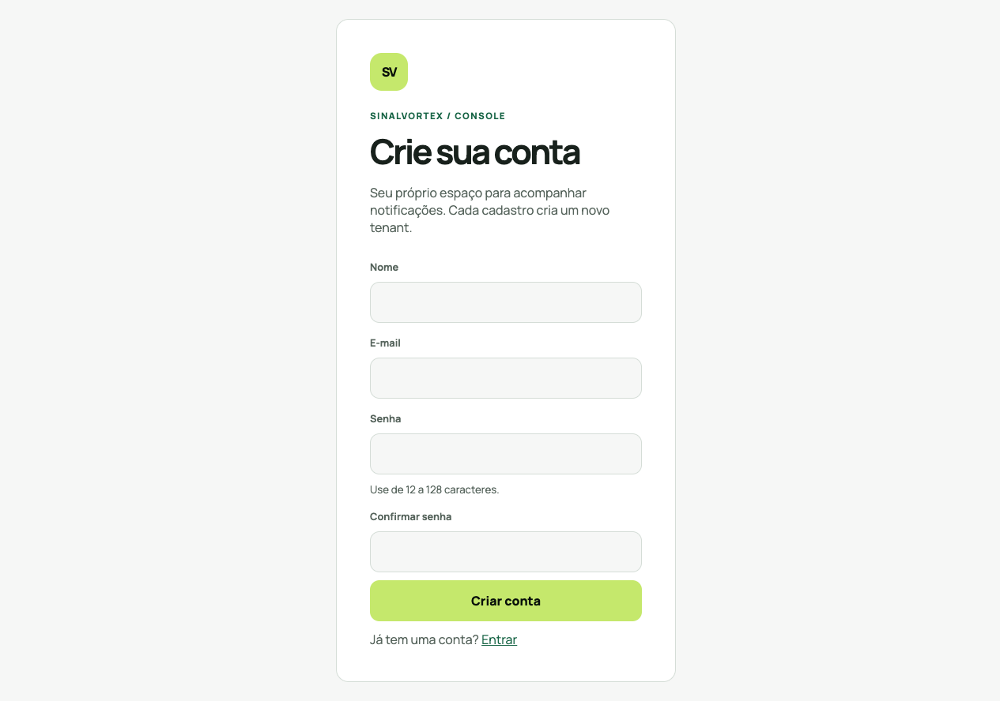
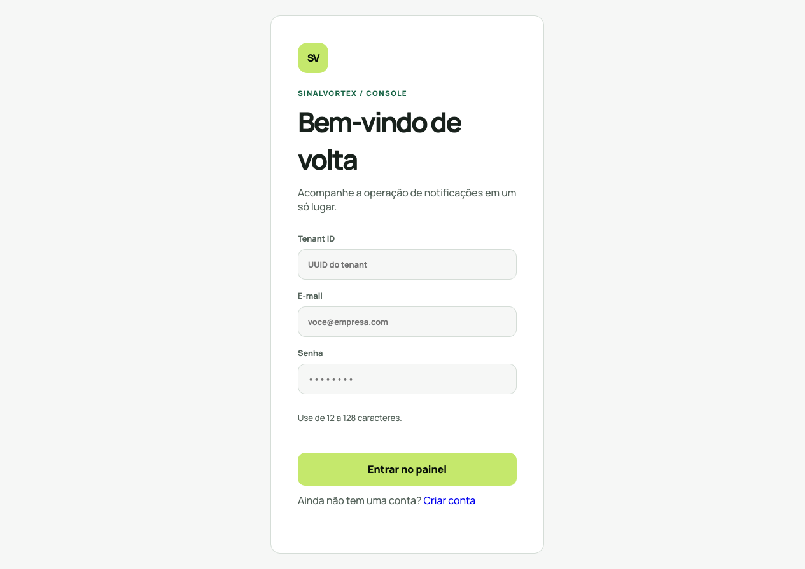

# SinalVortex - Monorepo

Plataforma distribuída de notificações assíncronas com API, Redis, Worker,
SMTP sandbox, retry, DLQ e monitoramento em tempo real. A demo foi desenhada
para tornar visível o caminho completo de uma mensagem sem depender de
provedores pagos.

## Demo pública para portfólio

Abra [localhost:4200/demo](http://localhost:4200/demo) para testar uma versão
gratuita e autocontida da ideia: um inbox em formato de conversa, envio
simulado e status exibido na própria tela. A demo usa apenas o armazenamento do
navegador e não envia mensagens reais, então pode ser publicada em um deploy
estático sem contratar SMTP ou cadastrar destinatários.

Essa rota é uma vitrine visual. O fluxo de engenharia completo continua na
[demonstração local](docs/local-demo.md), com API, PostgreSQL, Redis, Worker e
Mailpit.

## Demonstração local completa

Requer Docker com Compose. Na raiz do repositório:

```sh
docker compose -f docker-compose.local.yml up --build
```

Abra [Angular](http://localhost:4200), registre uma conta e use **Nova notificação**.
Acompanhe o status no Inbox, os eventos no Monitor de filas e a captura SMTP no
[Mailpit](http://localhost:8025). A [saúde da API](http://localhost:5287/health) fica na porta 5287.

API e Worker executam em containers separados com PostgreSQL e Redis compartilhados.
Não é necessário criar `.env`, instalar Node/.NET no host, configurar Railway, domínio
ou contratar SMTP. Mailpit é um sandbox local: não entrega e-mails a destinatários reais.
WhatsApp e SMS usam provedores simulados locais; Push continua demonstrando a
rota de falha/DLQ por ainda não possuir um provedor.

### Roteiro de 3 a 5 minutos

1. Crie uma conta e abra o Dashboard para mostrar o isolamento por tenant.
2. Envie um e-mail em **Nova notificação** e mostre a mensagem capturada no
   [Mailpit](http://localhost:8025).
3. Volte ao Inbox para mostrar a transição de processamento e abra o Monitor
   de filas para acompanhar os eventos via SignalR.
4. Envie SMS ou WhatsApp para mostrar o processamento pelo provedor simulado
   local e o status **Enviado**. Push continua disponível como exemplo de DLQ.

O Mailpit é um sandbox local: “aceito pelo SMTP” significa que a mensagem foi
capturada localmente, não que foi entregue a um destinatário externo.

Veja o [roteiro completo, persistência e testes](docs/local-demo.md).
A [configuração de produção/Railway](docs/production-configuration.md) continua disponível como caminho separado.

### Telas




## Executar e investigar envios

- [Envio de e-mail local com Mailpit](docs/real-delivery.md#desenvolvimento-local-com-mailpit)
- [Investigação: notificações indo para a DLQ](docs/investigations/notificacoes-dlq.md)
- [Monitor de filas](docs/queue-monitor.md)


## 📋 Estrutura do Projeto

```
SinalVortex/
├── backend/
│   ├── SinalVortex.Domain/          # Entidades de domínio rico e Value Objects
│   ├── SinalVortex.Application/     # Command/Query Handlers (MediatR) e DTOs
│   ├── SinalVortex.Infrastructure/  # EF Core, Redis, Repositórios e Polly
│   ├── SinalVortex.API/             # Web API RESTful (ASP.NET Core / Scalar)
│   ├── SinalVortex.Worker/          # Background Worker (Consumidor de Filas)
│   ├── SinalVortex.IntegrationTests/# Testes de Integração com Testcontainers
│   └── SinalVortex.slnx             # Solution do C#
└── frontend/app/                    # Interface de Administração (Angular 19)
```

## ⚙️ Tech Stack
- **.NET 10** (API + Worker)
- **PostgreSQL** 17 (persistência)
- **Redis 7** (filas e cache)
- **Angular 19** (frontend/admin UI)
- **Testcontainers** (integração e testes efêmeros)
- **OpenTelemetry** (telemetria e métricas)

## 🏗️ Arquitetura e Decisões Técnicas
A aplicação adota Clean Architecture e CQRS desacoplando a recepção das notificações (API) do envio real ao provedor (Worker).
```
[ Frontend Angular ] ──> [ API REST (.NET 10) ] ──> [ PostgreSQL (Persistência) ]
                                 │
                         (Enqueue Payload)
                                 ▼
                         [ Redis Queues ]
                                 │
                         (Dequeue/Process)
                                 ▼
                     [ SignalProcessingWorker ] ──> [ INotificacaoDispatcher ]
```
### Principais Decisões
- **EF Core + PostgreSQL**: Utilizado para persistência relacional auditável das notificações, logs de transição de status e gerenciamento de aplicações.
- **Redis**: Utilizado para mensageria FIFO em memória de baixa latência (separada por prioridades: Alta, Normal, Baixa e DLQ) e cache distribuído de dados de leitura frequente.
- **MediatR**: Garante desacoplamento na camada de aplicação, facilitando a inclusão de Pipeline Behaviors globais (Validação com FluentValidation e Log de Performance).

## 🛡️ Licença e Contato
Distribuído sob a licença MIT. Veja LICENSE para mais informações.
- Autor: Gabriel Mitsuru Kameoka Namazu
- GitHub: [Gabriel Kameoka](https://github.com/GabrielKameoka)
- LinkedIn: [gabrielkameoka.in](https://www.linkedin.com/in/gabriel-mitsuru/)
- E-mail: gabrielkameoka@gmail.com

## Fluxo e limites conhecidos

```text
Angular -> API -> PostgreSQL
              \-> Redis -> Worker -> SMTP -> Mailpit
                         \-> retry/DLQ
              \-> SignalR -> Monitor de filas
```

A API persiste e enfileira; o Worker processa fora do ciclo HTTP. O JWT define
o tenant das consultas, o PostgreSQL mantém o estado auditável e o Redis
transporta filas por prioridade e eventos do monitor. Migrations históricas e
colunas de compatibilidade continuam preservadas, mas CRM, templates e inbound
webhooks não fazem parte da superfície executável da demo.

Próximos passos: provedores reais de SMS/WhatsApp, templates, CRM, webhooks
inbound, observabilidade externa e deploy de produção. A stack local completa
usa Mailpit e simuladores seguros para demonstrar o fluxo sem custos ou
destinatários reais.
